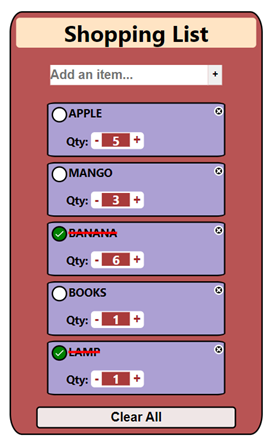

# Shopping List React App

## Description

The Shopping List React App is a simple and user-friendly application that allows users to create and manage their shopping lists efficiently. It offers the following functionalities:
1. **Add Items**: Easily add new items to your shopping list using the "+" button/press enter and a text input field. 
2. **Remove Items**: Remove unwanted items from the list by clicking on the cross icon on right top corner of each item.
3. **Check/Uncheck Items**: Mark items as purchased by checking them off, and uncheck them if you change your mind.
4. **Quantity Counter**: Specify quantities for each item.
5. **Clear All**: Clear the entire shopping list in one go with the "Clear All" button.
6. **Responsive Design**: The app is designed to be responsive and work seamlessly on various devices and screen sizes > 200px.



## Demo

Check out the demo video to see the Shopping List App in action

[ShoppingList-Video.webm](https://github.com/juhikumarimodi6/React-shopping-list/assets/71226446/772a65ad-fc9c-4e6c-9380-78a8b78931ef)


## Installation

To run the Shopping List React App locally on your machine, follow these steps:
1. Clone the repository to your local machine.
```
git clone https://github.com/juhikumarimodi6/React-shopping-list.git
```
2. Change into the project directory.
```
cd shopping-list-react
```
3. Install the dependencies.
```
npm install
```
4. Start the development server.
```
npm start
```
The app will open in your default web browser at http://localhost:3000.


## Dependencies

The app is built using the following dependencies:
- React: A JavaScript library for building user interfaces.
- React Icons: A collection of popular icons as React components.[react-icons](https://react-icons.github.io/react-icons/)
- React Hooks: useState(), useContext()
- LocalStorage: Used to store the shopping list data locally on the user's device.

## Contributing

Contributions to this project are welcome! If you find a bug or want to add new features, feel free to submit a pull request.

## Contact

If you have any questions or feedback, you can reach me at [juhikumarimodi6@gmail.com](mailto:juhikumarimodi6@gmail.com).

---
